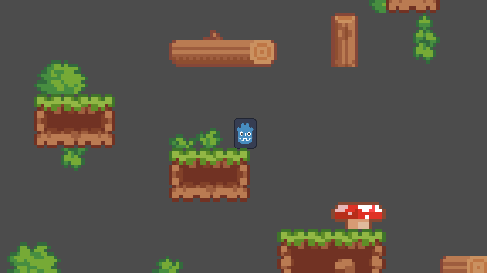

# Jumpstart Platformer

Simple platformer game made in Godot!

## Click [here](https://ethancubes.itch.io/jumpstart-platformer) to play the game

## Features
- Level that looks pretty nice
- Movement & physics
- Pretty fun

## Credits
- This game was made for Haven Jumpstart, thanks for giving me the opportunity to learn Godot and to host a game jam!
- This project was made in [Godot](https://godotengine.org/). The movement script is Godot 2D movement boilerplate code, slightly modified to change the keybinds
- Thanks to [Estella Gu (AKA TheMagicFrog)](https://www.youtube.com/watch?v=G7iZHazD4wo) for making a wonderful Godot tutorial!

- This project used the [Pixel Platformer Pack](https://disarmedgames.itch.io/pixel-platformer-pack) for the level.
